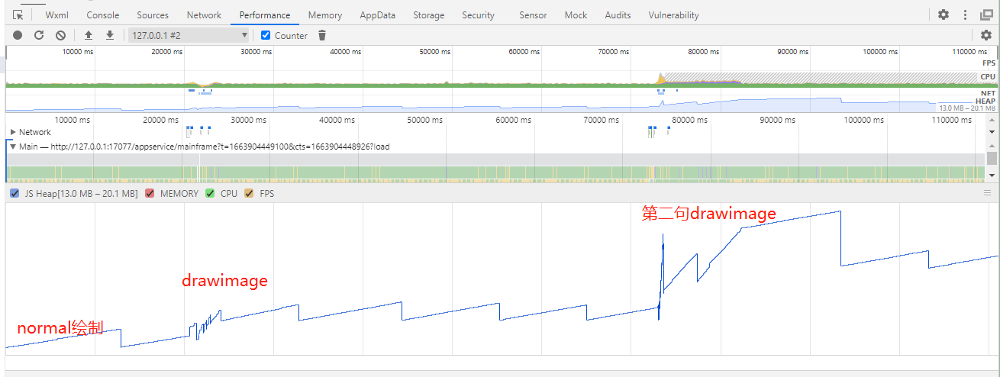

## 小程序调试工具端

### Performance

小程序内存持续增长

1.使用调试器工具记录从小程序加载到平稳运行持续1min

结论:内存已正常释放

**详细波段分析**

2.在正常运行后进行play talk ,后持续了1min

结论: 内存发生泄漏

3.猜测是否和 下载 图片有关,去除 下载后的所有业务处理代码(持续一分钟的对话)

需要主动释放,才完全平稳

或者时间足够长

结论: 内存可以正常释放(慢或者主动释放)

4.猜测: canvas.drawimage 导致 htmlImageElement 无法释放  (下载图片延时 和 drawimage 有关)

  实现步骤: 将227帧驱动真 改为100帧 持续30s

将227帧改成 8帧(1重置)持续30s

原来227帧 30s

为什么不在安卓测试,因为安卓真机没有performance

5.测试playtalk 回复一个75张图片("天气怎么样") 一个215张图片(固话彩铃), 内存增长变化

memory:

次数1

次数2 天气怎么样 image 41 回复(你猜啊)

结论: 内存泄漏和 playtalk 资源加载数量(图片或者音频)有关

Performance

本地存储 performance.json

6.测试初始化加载是否存在内存泄漏(延时60s初始化 aihuman),在30s的时候进行内存录制

结论:初始化加载图片存在内存泄漏

## 安卓端

### 测试机:华为荣耀(HUAWEI-AKA-AL10)

操作步骤

1.开始小程序后静置等待播放normal帧图片(等待20min)

结论:总共增加了0.3mb, 内存泄漏可忽略不计

2.开始小程序后,点击录音按钮,等待你好的 playtalk流程

结论:snapshot从22.8到24.3  发生了内存增长的情况,并且在点击gc后,并未有明显下降,发生内存泄漏

3.在绘制正常帧后进行 playtalk, 该组样例分别说了"喂喂喂","你好,喂喂喂","视频彩铃" 三句话

结论: 每次增加大概1m的js heap

4.playtalk了很多 话,点击gc无办法

结论:当一直说话,安卓机也会一直叠加js heap 到 memory告警

5.只说一句话 "你好"

结论: 只说一句话,也会造成js heap 增长

6.去除所有page里的对aihuman的引用

结论: 空页面加载 17.6m, 和正常22m 差了5m

## IOS端(黑盒)

### 苹果XR

版本递进:

1.基于1920*1080 1500张初始帧下载过渡到500张 1229 673 图片*

效果: 从开始的加载崩溃到 完成所以联通demo的彩铃对话

2.接入闲聊后,playtalk 一直增加 改进 去除缓存

效果: 从5句话到15句话

3.改进 销毁某些回调函数和实例(iamge的onload,onerror 和 audiocontext destroy)

效果

## 解决方案猜想

1.sdk轮播实现存在问题(更改为map的方式?)

2.canvas.drawimage 引用着playtalk的一些资源,导致资源未释放

~~3.更换htmlimageelement 的获取方式, 但是会很慢,且没有验证实现 (验证,单独下载 htmlimageelement 资源没与问题)~~

4.将drawimage 方法去除(还是存在内存泄漏)

5.再将audio存在去除 (依然存在)

再将image去除(需要再次验证)

~~将所有业务代码都注释掉,只保留requestAnimationFrame~~

结论: 是offScreenCanvas.requestAnimationFrame(drawFace);

验证:改用 setTimeout(drawFace, 16)

结论:失败

6.将绘制普通帧去除, 绘制talk保留依然存在问题

~~7.发现delete 数组问题,empty还是占用内存~~

## 遇到的问题:
